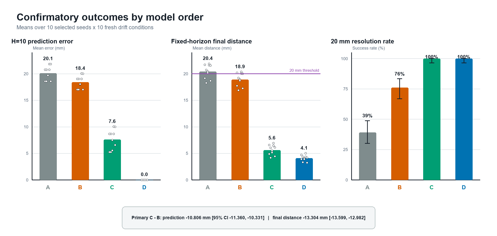

**When should an intelligent system decide that its current understanding of the
world is no longer sufficient — and how should it construct a better one?**

Physical AI is the current testbed, not the boundary of the question: embodiment
makes mismatch, timing, intervention, and recovery observable and consequential.

[Research program](program/README.md) · [GitHub](https://github.com/higuseonhye/research-os) · [Mismatch Lab](mismatch_lab/README.md)

---

## The sequence

Each paper changes the decision under test, not the question.

| | Decision under test | Status | |
| --- | --- | --- | --- |
| **001** | Is the failure recoverable at all? | Tier C complete | [working paper](paper1/paper001_recoverability_complete.pdf) |
| **002** | Repair the parameters, or change the model class? | Tier C complete | [project page](paper002/project_page.html) |
| **003** | Does changing it open capability a repair cannot reach? | Calibration pilot; not preregistered | [docs](paper003/README.md) |
| **Lab** | Can rollout differences flag model inadequacy? | Public spec | [Robot Diff demo](mismatch_lab/diff_explorer_v0.1.html) |

---

## Paper 002 — when parameter repair is not enough

A preregistered Isaac Sim target-drift study. After the best allowed zero-order
repair, a rule-based adequacy gate can activate a prepared constant-velocity
expansion.

**400/400 valid cells.** Gated expansion vs repaired zero order:

| Endpoint | Effect | 95% CI |
| --- | ---: | ---: |
| H=10 prediction error | **−10.806 mm** | [−11.360, −10.331] |
| Fixed-horizon final distance | **−13.304 mm** | [−13.599, −12.982] |

Favourable in 100/100 paired conditions. The gate fired on 100/100
persistent-drift trials and 0/100 static, noise, and impulse controls; static
retention held.

*Supported:* a prepared model-order expansion within the tested Isaac
target-drift family. *Not supported:* general world-model expansion, autonomous
variable invention, hardware transfer, tissue or contact validity, clinical
efficacy, peer review.

[Project page](paper002/project_page.html) · [Manuscript](paper002/paper002_manuscript_model_order_v1.1.pdf) · [Supplement](paper002/paper002_supplement_model_order_v1.1.pdf) · [Results](https://github.com/higuseonhye/research-os/blob/master/experiments/surgical_intelligence/exp_surg_003_wm_expansion/results/isaac_model_order_confirmatory_v1.0/RESULTS.md)

---

## Paper 003 — does expansion open capability, or only lower error?

Ten-seed Isaac calibration pilot. **Excluded from confirmatory evidence.**

| Condition | Missing | Repair | Mode expansion | Relation expansion |
| --- | --- | ---: | ---: | ---: |
| Coupled | relation | 0.56 | 0.22 | **0.67** |
| Drift | mode | 0.00 | **1.00** | 0.00 |
| Static / noise | none | 1.00 / 0.40 | 1.00 / 0.00 | 1.00 / 0.40 |

**The dissociation is the result, not the relation arm winning.** Each operator
answers only the gap it was built for — the mode operator takes drift outright
and the relation operator declines there — which is what rules out the latter
simply being a stronger predictor. Where no gap exists it is numerically
identical to plain repair. Its 0.67 against 0.56 is six cells against five, and
is reported as a sample-size observation.

Two things this page previously claimed and no longer does: that the relation
arm reached 1.00, and that a continuous tracking task could measure any of this.
The first came from a degenerate head-on geometry that concealed a modelling
error; the second showed no separation between any arms at all. Both are
recorded in the [pilot results](https://github.com/higuseonhye/research-os/blob/master/experiments/surgical_intelligence/exp_surg_004_relation_expansion/results/isaac_relation_pilot_v0.1/RESULTS.md)
with the corrections that followed.

Still open: the coupling is injected rather than simulated, so the relation arm
inverts a function this repository wrote. Under real contact its model becomes
misspecified and accuracy is **expected to drop** — recorded before that run.

[Paper 003 docs](paper003/README.md) · [draft preregistration](paper003/paper003_prereg_draft_v0.1.md)

---

## How this work is done

Preregistered confirmatory designs with frozen decision rules · process-isolated
simulation cells with execution-validity checks · negative controls and paired
endpoints · public code, configs, trajectories, and checksum manifests.

Negative and design-stage results are published alongside positive ones, with
the reasoning that produced them — including retracting a favourable result when
its geometry turned out to be degenerate.

---

All work in this repository is independent personal research. Where Seonhye Gu
is affiliated with the AI-Based Surgical Robot Innovation Lab, the affiliation
is for identification only and does not imply sponsorship or endorsement.

Contact: [@higuseonhye](https://github.com/higuseonhye)

*Updated 2026-08-04*
