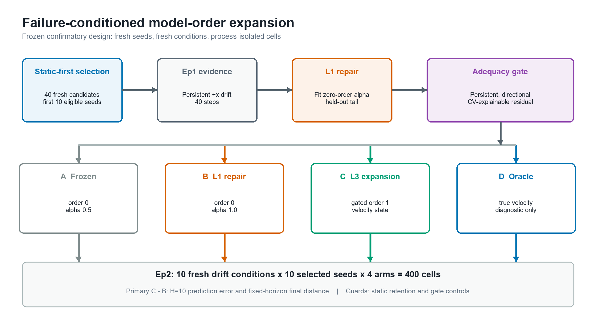
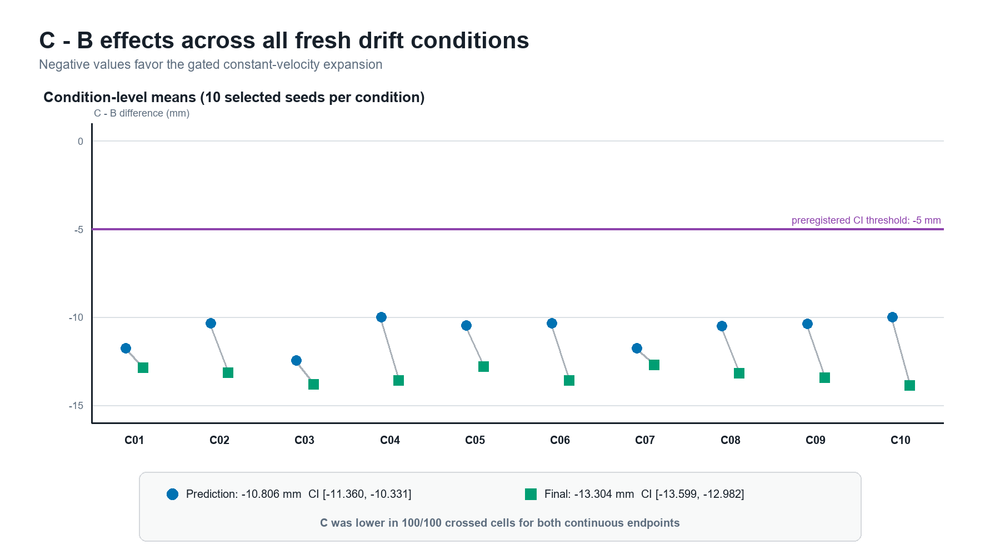
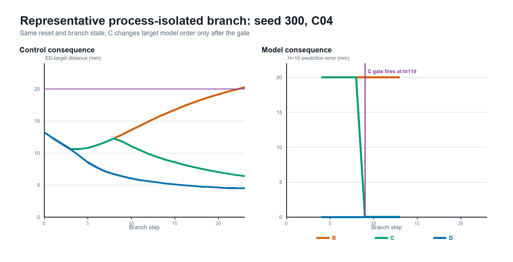
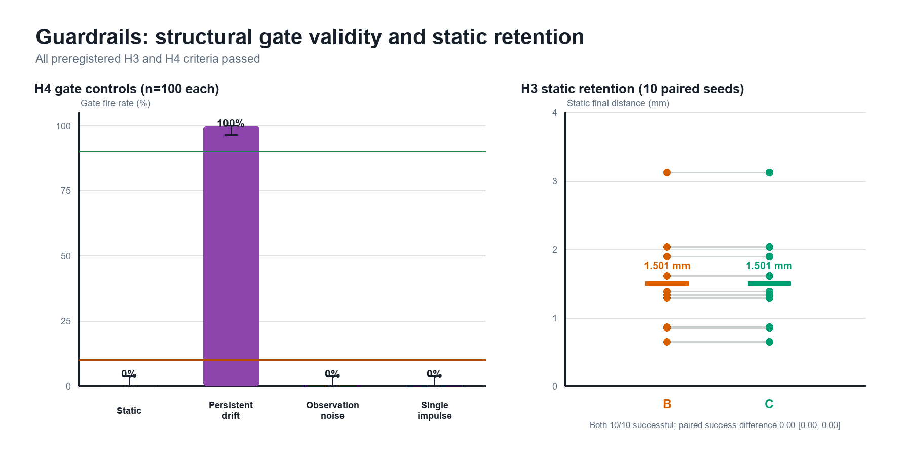

# When Parameter Repair Is Not Enough: Failure-Conditioned Target-Dynamics Model-Order Expansion in Embodied Simulation

> Paper 002 manuscript v1.0
>
> Status: complete confirmatory draft
>
> Frozen design: `paper002-model-order-confirmatory-v1.0`
>
> Confirmatory artifact: `73a7e16`

## Abstract

Embodied agents commonly respond to prediction failure by updating parameters
inside a fixed model class. This response is insufficient when the observed
dynamics require state variables that the current class cannot represent. We
study a restricted model-adequacy decision in Isaac Sim surgical reach: after
persistent target drift remains unexplained by zero-order parameter repair,
should the agent retain the repaired model or activate a prepared
constant-velocity state expansion? A preregistered structural gate detects
persistent, directional residuals that are better explained by the expanded
class. We compare a frozen zero-order model, a repaired zero-order model, a
gated constant-velocity model, and a velocity oracle. The confirmatory design
uses the first 10 statically eligible seeds from 40 fresh candidates, 10 fresh
balanced drift conditions, and a fresh Isaac process for each
seed-arm-condition cell. All 400 primary cells and 20 static-retention cells
passed execution-validity checks. Relative to repaired zero order, gated
constant velocity reduced mean open-loop H=10 prediction error by 10.806 mm
(crossed-bootstrap 95% CI [10.331, 11.360] mm improvement) and fixed-horizon
final distance by 13.304 mm (95% CI [12.982, 13.599] mm improvement). It was
better on both continuous endpoints in 100/100 paired seed-condition cells.
The secondary 20 mm resolution rate was 100% versus 76%. Static retention was
10/10 for both models with identical 1.501 mm mean final distance. The gate
fired on 100/100 persistent-drift cases and 0/100 static, observation-noise,
and single-impulse controls. These results support a narrow claim: structured
failure after parameter repair can justify a prepared increase in target-model
order and improve prediction-linked control without nominal regression. They
do not establish autonomous world-model invention or clinical validity.

**Keywords:** model adequacy, structural adaptation, world models, embodied
control, model order, surgical simulation, preregistration

## 1. Introduction

World models support prediction and action by representing how an environment
changes. When their predictions fail, a natural first response is parameter
repair: update a filter coefficient, fit a new rate, or fine-tune network
weights without changing the set of represented state variables. This is a
parsimonious and often correct response. It cannot succeed, however, when the
data-generating process depends on a dynamic variable absent from the model.

This distinction separates parameter error from structural inadequacy. A
zero-order target model can update its estimate of current position but cannot
carry velocity as state. Under persistent drift, aggressive position updates
reduce lag without yielding a correct multi-step forecast. A first-order model
can represent the missing dynamic mode, but indiscriminate expansion risks
complexity and false activation under noise or transient impulses. The central
question is therefore not merely whether an expanded model can perform better.
It is whether observed failure provides sufficient evidence to warrant that
expansion.

We operationalize this question in an Isaac Sim surgical-reach task. A shared
Episode 1 trace exposes a zero-order target model to persistent drift. Parameter
repair searches the permitted zero-order coefficient. A locked adequacy gate
then tests whether the residual is persistent, directionally consistent, and
better explained by constant velocity. Episode 2 evaluates four target-model
arms on unseen directions, speeds, delays, and durations while holding the
Cartesian controller fixed. Static retention and matched negative controls
constrain the expansion claim.

The confirmatory study was frozen before fresh-data execution. It contributes:

1. A failure-conditioned adequacy test that distinguishes within-class repair
   from a prepared increase in target-dynamics model order.
2. A prediction-to-control intervention in which the model's H=10 forecast is
   the controller target, making behavior sensitive to model quality.
3. A process-isolated crossed design with static-first seed selection, fresh
   conditions, paired continuous endpoints, and complete execution auditing.
4. Negative-control and nominal-retention evidence that the structural gate is
   selective rather than a generic anomaly detector.

The contribution is deliberately bounded. We evaluate one missing variable,
velocity, and one prepared operator, constant-velocity expansion. The study is
an adequacy-test cell, not unconstrained architecture search or autonomous
causal concept invention.



**Figure 1.** Static-first confirmatory protocol. After zero-order repair and
the locked adequacy test, all four arms are evaluated on a complete fresh
seed-condition grid. C versus B is the primary contrast.

## 2. Related Work And Positioning

Latent predictive world models learn compact transition representations for
planning, policy learning, simulation, evaluation, and synthetic experience.
Continual world-model methods primarily ask how to absorb new experience while
retaining old dynamics. Modular approaches instead route among models or add
experts. Test-Time Mixtures of World Models (TMoW), multi-scale mixtures such
as MuSix, Worldscape-MoE, and Local Module Composition (LMC) establish that
modularity and test-time structural adaptation can be useful.

Our question precedes the choice of update algorithm: when does failure after
parameter repair count as evidence that the current class is inadequate? The
comparison is therefore between no update, parameter repair within order zero,
and a gated increase to order one. The gate is judged both by downstream
prediction and control and by its refusal to activate on nominal, noise, and
impulse controls. Closest modular work supplies important precedents for adding
or routing components; our empirical wedge is the failure-conditioned repair
versus expansion decision and its guardrails.

Related causal and compositional world-model work seeks invariant mechanisms,
sparse transition changes, or symbolic repair. Those broader goals motivate
the program but are not tested here. Our expansion operator and candidate
variable are known in advance.

## 3. Methods

### 3.1 Environment And Task

Experiments use Isaac Sim 4.1 with the ORBIT Surgical dual-arm reach task
`Isaac-Reach-Dual-STAR-IK-Rel-Play-v0`. The evaluated end effector follows a
target command in Cartesian space. The nominal target mode M0 is static. In M1,
the target begins persistent planar drift after a specified delay:

```text
M0: x(t+1) = x(t)
M1: x(t+1) = x(t) + v, after the locked onset and delay
```

All arms share the same scripted Cartesian controller, gain 1.0, maximum action
delta 0.08, and 20 mm resolution tolerance. The model forecast is installed as
the policy target while the true simulator command is restored for evaluation
at every step. Consequently, arm differences arise from target prediction and
gate state rather than controller tuning.

### 3.2 Episode 1 Evidence And Parameter Repair

The shared Episode 1 trace contains 40 steps of +x drift at 1.5 mm per step.
The first model class is zero order: it estimates target position but has no
velocity state. Four locked position-update candidates are fit on the common
trace (`alpha` = 0.25, 0.5, 0.75, 1.0), and the best held-out H=10 predictor is
selected. This is the permitted L1 parameter repair.

The prepared expanded class adds a velocity estimate and extrapolates position
at H=10 under constant velocity. Its position and velocity coefficients are
selected from the same evidence without using confirmatory Episode 2 outcomes.

### 3.3 Structural Adequacy Gate

The gate uses an eight-step window and requires at least four target deltas. It
fires only when all locked conditions hold:

- mean speed is at least 0.5 mm per step;
- at least 75% of deltas are active;
- directional consistency is at least 0.90; and
- constant velocity improves one-step fit over zero order by at least 0.50.

The same rule is evaluated on persistent drift and on three controls: static
target, 0.2 mm observation noise, and a single impulse followed by rest.

### 3.4 Arms

| Arm | Target model | Role |
| --- | --- | --- |
| A | Frozen zero order, position alpha 0.5 | Secondary baseline |
| B | Repaired zero order, position alpha 1.0 | Primary comparator |
| C | Gated constant velocity, position/velocity alpha 1.0 | Primary intervention |
| D | True injected velocity | Diagnostic oracle |

A and B cannot represent velocity. C remains parsimonious until the adequacy
gate fires, after which it carries an estimated velocity state. D supplies the
true velocity from onset and bounds model-side error; it is excluded from the
primary comparison.

### 3.5 Fresh Sample And Conditions

Candidate seeds were fixed as integers 300 through 339. Static control was run
before treatment. The first 10 statically eligible seeds in numeric order were
selected, preventing treatment performance from influencing inclusion.

Episode 2 uses 10 conditions, C01-C10, with no exact pilot-condition reuse.
The set balances positive and negative x/y axes and all four planar diagonals.
Speeds range from 1.7 to 2.0 mm per step, delays from one to five steps, and
durations from 20 to 23 steps. The full primary grid is 10 selected seeds by 10
conditions by four arms, or 400 cells. Static retention adds 20 B/C cells.

### 3.6 Execution Isolation And Validity

An engineering pilot initially batched conditions inside one Isaac process.
Although the same reset seed was supplied, preceding trajectories affected
later reset outcomes. That pilot version was rejected. The corrected pilot and
confirmatory study launch a fresh Isaac process for every seed-arm-condition
cell.

The run is invalid if the grid is incomplete, a prefix is not statically ready,
paired branch-start end-effector states differ by more than 1 mm, commands
differ by more than 1 micrometer, branch-start target distance exceeds 21 mm,
prediction windows are missing, drift exposure is incomplete, the simulator
resets unexpectedly, or a forbidden region is entered. No failed cell is
silently removed.

### 3.7 Outcomes And Confirmatory Rules

The primary estimand is intention-to-treat over all valid selected-seed and
condition cells.

- **H1 prediction:** C minus B mean true open-loop H=10 prediction error. The
  95% interval upper endpoint must be at most -5 mm.
- **H2 behavior:** C minus B mean final end-effector distance after full drift
  exposure. The 95% interval upper endpoint must be at most -5 mm.
- **H3 retention:** C static success must be at least 95%, and the lower
  endpoint for C minus B static success must exceed -5 percentage points.
- **H4 gate validity:** persistent-drift activation must be at least 90%, and
  each control activation rate must be at most 10%.

The 20 mm binary resolution rate is secondary because the process-isolated
pilot showed threshold saturation. Diagnostic gates require at least 80%
success for C and D, reproduction of the Episode 1 parameter lock, and a valid
execution grid. Confirmatory support requires all criteria to pass.

For H1 and H2, seeds and conditions are independently resampled with
replacement in a crossed bootstrap with 10,000 draws and RNG seed 20260730.
We report the mean paired C-minus-B contrast, two-sided percentile 95%
interval, and the fraction of the 100 paired cells favoring C. Gate rates use
Wilson 95% intervals.

### 3.8 Preregistration And Pilot Separation

The design, conditions, selection rule, thresholds, estimands, and decision
criteria were frozen under immutable tag
`paper002-model-order-confirmatory-v1.0` before seeds 300-339 were run. Pilot
seeds and observations are excluded from every confirmatory estimate. There
was no interim efficacy analysis or optional stopping.

## 4. Results

### 4.1 Accounting And Execution Validity

Thirty-four of 40 fixed candidates passed static control. The first 10 eligible
seeds were 300, 301, 302, 303, 304, 305, 307, 308, 310, and 311. All 400 primary
cells and all 20 retention cells completed. The maximum paired branch-start
end-effector and command gaps were both zero. Maximum branch-start target
distance was 15.396 mm, below the 21 mm limit. Every prefix was ready, every
prediction window was present, and every cell received full drift exposure.
There were no unexpected resets or forbidden-region violations. The run was
therefore valid.

### 4.2 Episode 1 Reproduced Structural Inadequacy

The zero-order repair selected alpha 1.0 but retained 15.000 mm held-out H=10
prediction error. Constant velocity selected position and velocity alpha 1.0
and reduced the same diagnostic error to numerical zero. The gate fired with
active fraction 1.0, directional consistency 1.0, and constant-velocity fit
improvement 1.0. The preregistered parameter and gate locks were reproduced.

### 4.3 Prediction And Fixed-Horizon Control

| Arm | n | H=10 prediction error | Final distance | Resolution rate |
| --- | ---: | ---: | ---: | ---: |
| A frozen zero-order | 100 | 20.081 mm | 20.388 mm | 39% |
| B repaired zero-order | 100 | 18.401 mm | 18.905 mm | 76% |
| C gated constant velocity | 100 | 7.595 mm | 5.601 mm | 100% |
| D oracle velocity | 100 | 0.000 mm | 4.087 mm | 100% |

For H1, C minus B prediction error was -10.806 mm (95% CI [-11.360,
-10.331] mm). For H2, C minus B final distance was -13.304 mm (95% CI
[-13.599, -12.982] mm). Both interval upper endpoints exceed the locked 5 mm
improvement requirement in the favorable direction. C had lower prediction
error and lower final distance in all 100 paired seed-condition cells.

The secondary resolution-rate difference was +0.24 (95% CI [+0.08, +0.45]):
C resolved 100/100 cells and B resolved 76/100. A resolved 39/100. D resolved
100/100 and had zero forecast error. C's remaining 1.514 mm mean final-distance
gap to D is consistent with the finite evidence window before its gate fires.


**Figure 2.** Arm-level confirmatory outcomes. Dots show condition means for
the continuous endpoints; success bars include Wilson intervals. The 20 mm
line is shown for context but is not the H2 primary criterion.

### 4.4 Effects Were Consistent Across Fresh Conditions

Condition-level C-minus-B prediction differences ranged from -12.462 to
-9.998 mm. Final-distance differences ranged from -13.888 to -12.716 mm. C
resolved all 10 seeds in every condition, while B ranged from 5/10 to 10/10.
No condition reversed either continuous primary effect.



**Figure 3.** Mean C-minus-B effects by fresh Episode 2 condition. Every
condition lies beyond the -5 mm criterion for both endpoints; the formal
decision uses the crossed-bootstrap interval over all cells.

### 4.5 Representative Mechanism Trace

In the process-isolated seed 300/C04 branch, B and C begin from the same state
and initially share the same zero-order prediction. C's gate fires after enough
directional evidence accumulates. Its H=10 prediction error then falls from 20
mm to numerical zero, and end-effector distance decreases to 6.4 mm; B remains
at 20 mm forecast error and finishes at 20.2 mm. The oracle fires earlier and
finishes at 4.5 mm. This trace is illustrative; all inferential results use the
complete crossed sample.



**Figure 4.** Representative seed 300/C04 branch. The vertical line marks the
first C gate activation. B, C, and D are process-isolated but start from exactly
matched reset and branch states.

### 4.6 Static Retention And Gate Controls

B and C each retained 10/10 static successes and identical 1.501 mm mean final
distance. The paired success-rate difference was 0.00 with 95% interval [0.00,
0.00], passing the -5 percentage-point non-inferiority margin.

The gate fired in 100/100 persistent-drift evaluations (Wilson 95% CI [96.30%,
100%]) and 0/100 evaluations for each of static target, observation noise, and
single impulse (each Wilson upper 95% bound 3.70%). H3 and H4 passed.



**Figure 5.** The gate separates persistent structured drift from matched
negative controls, while the expanded arm is unchanged from repaired zero
order on static retention.

### 4.7 Confirmatory Decision

Every conjunctive decision field passed: execution validity, Episode 1
parameter lock, oracle behavior, C success floor, H1 prediction interval, H2
final-distance interval, H3 retention, H4 drift activation, and H4 control
specificity. The preregistered confirmatory result is therefore positive.

## 5. Discussion

The experiment isolates a case in which a stronger parameter update is not a
substitute for the missing state variable. Moving alpha from 0.5 to 1.0 helps
the zero-order model follow current position, improving prediction by 1.680 mm
and final distance by 1.483 mm relative to frozen zero order, but it cannot
represent velocity. The gated order-one model produces a much larger change:
10.806 mm lower forecast error and 13.304 mm lower final distance than the best
allowed zero-order repair.

This prediction-to-control alignment matters. The expanded model does not only
fit a held-out trace; its H=10 forecast changes the target presented to an
otherwise fixed controller. The continuous control outcome improves in every
paired cell. The oracle shows that remaining C error comes from evidence
collection and gate latency rather than the controller's inability to exploit
a velocity forecast.

The negative controls delimit the trigger. A high residual by itself would not
justify expansion because observation noise and a transient impulse can also
create error. Requiring sustained activity, directional consistency, and
superior alternative-class fit yielded 100% activation on persistent drift and
0% on each control. Static retention further shows that the added state was not
forced into nominal behavior.

The result supports a conditional statement: for the tested persistent-drift
family, failure evidence that survives zero-order repair and is predictably
explained by constant velocity warrants activating that prepared order-one
model. It does not show that every persistent failure is structural or that a
system can discover the correct variable without a candidate class.

## 6. Limitations

1. **Prepared expansion.** Velocity and the constant-velocity operator are
   supplied in advance. The system selects between model classes; it does not
   invent a new variable or architecture.
2. **Narrow dynamics family.** The hidden change is planar constant drift.
   Acceleration, interaction, deformation, contact, and multimodal dynamics are
   outside the confirmatory cell.
3. **Scripted controller.** The target forecast drives a deterministic
   Cartesian controller, not a learned policy or general model-predictive
   controller. This is useful for causal isolation but limits behavioral scope.
4. **Selection-conditioned population.** The estimand applies to statically
   controllable initializations under the frozen static-first rule. It does not
   represent all Isaac resets.
5. **Single simulator and task.** Evidence comes from one ORBIT Surgical reach
   task in Isaac Sim 4.1. The asset stack emitted known PhysX mass/inertia
   warnings; no independent physical mass-property validation was performed.
6. **No physical or clinical validation.** No tissue interaction, hardware
   robot, clinician, patient, or operating-room deployment was evaluated.
7. **Gate form.** Thresholds are rule based and calibrated on an excluded
   engineering pilot. Learned or probabilistic adequacy tests remain future
   work.

The next scientific step is not to broaden the present claim by wording. It is
to test whether the same repair-versus-expansion decision survives new dynamic
families, richer observations, learned controllers, and hardware measurement.

## 7. Conclusion

In a preregistered, process-isolated embodied-simulation experiment, a repaired
zero-order target model remained structurally unable to forecast persistent
drift. Activating a gated velocity-state expansion reduced H=10 prediction
error and fixed-horizon final distance by more than the locked 5 mm margins,
with consistent benefit across every paired cell, no static regression, and no
false activation on three negative controls. Failure after parameter repair can
therefore support a restricted model-adequacy decision when the alternative
class is prepared and the claim is guarded by prediction, control, retention,
and specificity tests.

## Data, Code, And Reproducibility

- Frozen preregistration:
  [`paper002_model_order_confirmatory_prereg_v1.0.md`](paper002_model_order_confirmatory_prereg_v1.0.md)
- Exact result audit:
  [`RESULTS.md`](../../experiments/surgical_intelligence/exp_surg_003_wm_expansion/results/isaac_model_order_confirmatory_v1.0/RESULTS.md)
- Config:
  [`model_order_confirmatory_v1.0.json`](../../experiments/surgical_intelligence/exp_surg_003_wm_expansion/config/model_order_confirmatory_v1.0.json)
- Raw records, preconditions, and trajectories:
  [`isaac_model_order_confirmatory_v1.0`](../../experiments/surgical_intelligence/exp_surg_003_wm_expansion/results/isaac_model_order_confirmatory_v1.0/)
- Figure and table generator:
  [`plot_paper002_model_order.py`](../../scripts/plot_paper002_model_order.py)
- Generated figure/table manifest: [`figures/manifest.json`](figures/manifest.json)

All raw artifacts carry SHA-256 checksums. The figure manifest hashes both
source JSON files and every derived panel/table. Pilot results are retained in
the repository but excluded from confirmatory estimates.

## References

This draft uses linked reference anchors pending venue-specific bibliography
formatting.

1. [World Model for Robot Learning: A Survey](https://arxiv.org/abs/2605.00080).
2. [Test-Time Mixture of World Models](https://arxiv.org/abs/2601.22647).
3. [MuSix: Multi-scale Mixture of World Models](https://arxiv.org/abs/2607.00457).
4. [Worldscape-MoE](https://arxiv.org/abs/2607.03964).
5. [Local Module Composition](https://openreview.net/forum?id=LJjC6DmSkgT).
6. [DRAGO](https://openreview.net/forum?id=DiqeZY27XK).
7. [Variational Causal Dynamics](https://openreview.net/forum?id=a1ttBXvNCLO).

The fuller positioning matrix and submission bibliography checklist are in
[`paper002_related_work_v0.2.md`](paper002_related_work_v0.2.md).
