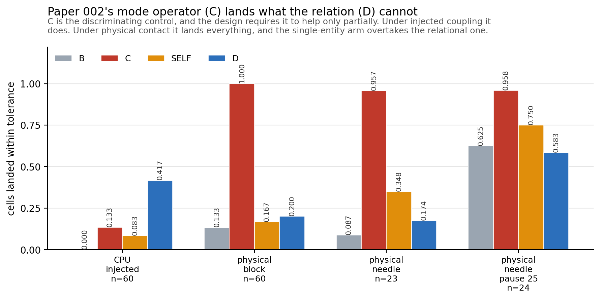
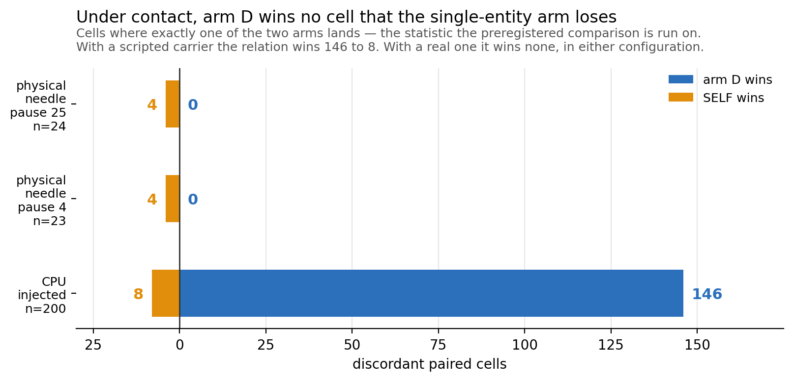
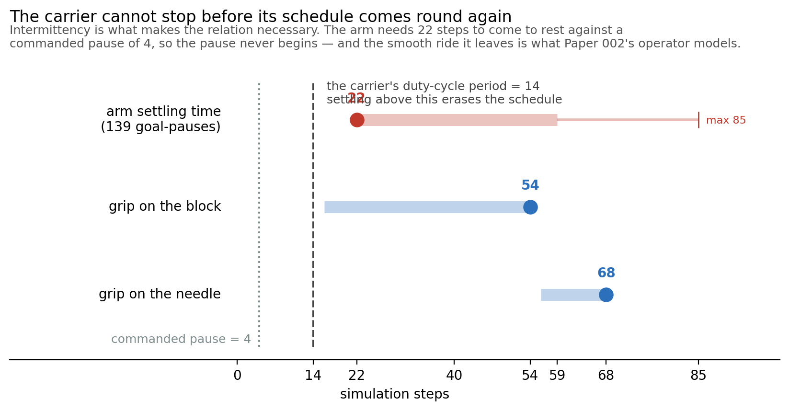
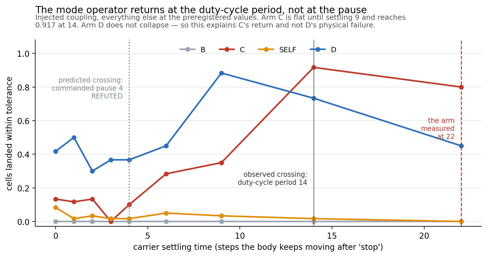

# What a Missing-Relation Cell Requires: Four Candidate Relations and a Negative Result Under Physical Contact

> Paper 003 manuscript **v1.0**
>
> **Status: complete. The experimental line is closed and no further runs are
> planned.** Every number is measured and linked, and what remains open is
> recorded as a limitation rather than as pending work — see §7 and *Limitations
> that will not be closed*.
>
> Design: [`paper003_prereg_v1.0.md`](paper003_prereg_v1.0.md), locked
> 2026-08-04, [closed](paper003_prereg_v1.0.md#closure--what-the-pilot-returned-and-what-it-licenses)
> 2026-08-05 without amendment to any locked rule.
>
> **No confirmatory run was performed.** All physical evidence is calibration,
> and the preregistration excludes calibration from confirmatory estimates. This
> paper therefore reports what calibration established, and states in §7 exactly
> which claims it does not support.

## Abstract

Paper 002 showed that structured failure after parameter repair can justify a
prepared increase in target-model *order* — a missing dynamic mode. The natural
next cell in the taxonomy is a missing *relation*: a residual conditioned not on
an unrepresented state variable of the target, but on a second entity. We
preregistered a design for that cell, built it, and report a negative result.

We evaluated four candidate relations against three requirements fixed in
advance: the relation's effect must exceed the task tolerance, a single-entity
model of the target must not suffice, and the relation must not be reducible to a
dynamic mode. **Collision** fails the first — a struck target's displacement per
contact is of the order of the interaction radius, five independent measurements
placing it below the 20 mm placement criterion. **Carriage** fails the second —
a model observing only the target's own trajectory matched the relational arm
exactly. **Capture** — a body arrives at a still target and carries it off —
satisfies all three under injected coupling, where the relational arm scores
0.650 against a single-entity competitor's 0.000 across 200 preregistered paired
cells (one-sided exact McNemar, 130 discordant pairs, none the competitor's,
p = 7.3 × 10⁻⁴⁰).

Under **physical contact** in Isaac Sim it fails the third. Across 107 cells and
three configurations of a surgical needle driver, Paper 002's constant-velocity
mode operator lands **0.957 to 1.000** of cells while the relational arm lands
0.174 to 0.583 and **never wins a paired cell that the single-entity arm loses**
(0 against 4, twice). The relation is made necessary by *intermittency*, and the
arm requires a median of 22 steps to come to rest after its goal stops, against a
commanded pause of 4 and 54 steps of grip on the object: **the pause never
begins**. Restoring it at the derived duration, on a better-held object with room
for it, left the mode operator at 0.958.

The contribution is the requirement set, the measurement that each candidate
fails, and a physical criterion recovered by sweeping the carrier's settling time
under injected coupling: the mode operator returns once settling reaches the
carrier's duty-cycle period, 0.133 to 0.917 across that threshold. The same sweep
refutes the tidier account we started with — arm D does **not** collapse under a
smoothed carrier, so settling explains the mode operator's return and not the
relational arm's physical failure, which remains open.

**Keywords:** world models, structural adaptation, relational models, negative
results, preregistration, embodied control, surgical simulation

---

## 1. Introduction

An embodied agent whose predictions fail can respond at three depths. It can
repair parameters inside a fixed model class. It can expand the class to
represent a state variable it lacked — Paper 002's *model-order expansion*. Or it
can expand the class to represent a *dependence on another entity*, which is a
change of a different kind: the model gains not a variable but an argument.

This paper concerns the third. The program's governing principle is that
intelligence chooses the *smallest sufficient change*, so a relational expansion
is warranted only where a mode expansion is insufficient. That is a demanding
condition, and this paper's result is that it is more demanding than it appears.

We report a negative result and a positive characterisation. The negative result
is that the task family we built does not exhibit a missing relation under
physical contact: Paper 002's operator suffices. The positive characterisation is
the requirement set that makes the negative result informative — three
task-level requirements, each of which eliminated a candidate relation on
measured grounds, and one physical requirement on the manipulator that emerged
from the failure and that we can state quantitatively.

### 1.1 Why publish this

Three reasons, in ascending order of importance.

1. The requirement set is reusable. Anyone building a missing-relation
   benchmark must satisfy it, and three of the four requirements are cheap to
   check before any hardware is involved.
2. The mode/relation boundary is not where the taxonomy places it. Paper 002's
   constant-velocity operator absorbed a coupling designed specifically to be
   outside it. That is a finding about the taxonomy, not about this scene.
3. The failure is *quantitative and locatable*: the mode operator returns as the
   carrier's settling time crosses its duty-cycle period, measured by sweeping
   that one parameter. It says what a future scene must supply — and the same
   sweep bounds how much of the result it explains.

---

## 2. Design, locked before measurement

The full preregistration is [`paper003_prereg_v1.0.md`](paper003_prereg_v1.0.md).
Its design was locked on 2026-08-04, before any physical cell was run, and no
locked rule was changed afterwards. The elements needed to read this paper:

### 2.1 Task

A commitment point. The agent commits to an irreversible placement onto a target
that a reference body captures and carries. The action takes `dispense_latency`
steps and lands wherever the target is at completion; there is no correction.
The structure is required, not incidental — a continuous reach-and-hold version
produced no separation between any arms, because continuous re-aiming averages
prediction error away.

Placement tolerance **20 mm**, on two grounds fixed before Paper 003 existed: the
task family's own `mdp/terminations.py` threshold, and the block's half-height.

### 2.2 Arms

| Arm | Target model | Role |
| --- | --- | --- |
| A | Frozen | Secondary baseline |
| B | Parameter repair within the independent-entity model | Primary comparator |
| **C** | **Mode expansion — Paper 002's prepared operator** | **Discriminating control** |
| **SELF** | **The target's own trajectory, no second entity observed** | **Decisive competitor** |
| **D** | Relation expansion — prediction depends on the second entity | Primary intervention |
| D\* | Relation with the true landing supplied | Diagnostic ceiling |

All arms share controller, task, tolerance and commit policy, and differ only in
the predicted landing point. Arm D falls back to arm B when its gate does not
fire, so `D ≥ B` holds by construction; the informative quantities are how often
D engages and how much it wins by when it does, and both are reported throughout.

SELF is deliberately **ungated** — arm D may act only when the relation-adequacy
gate fires, SELF acts whenever its own pattern is identifiable. The asymmetry
favours the competitor by design.

### 2.3 Requirements on the relation, fixed in advance

The preregistration states these as the grounds on which the relation was
chosen. Restated here as the paper's evaluation criteria:

- **R1 — the effect must exceed the tolerance.** The relation must move the
  target further than the task's own success criterion, or no arm can be
  distinguished by it.
- **R2 — the relation must be necessary.** A model observing only the target's
  own trajectory must not suffice. This is what arm SELF tests.
- **R3 — the relation must not reduce to a mode.** The second entity's influence
  must not be expressible as a dynamic mode of the target alone. This is what arm
  C tests, and it is the requirement Paper 002 imposes on Paper 003.
- **R4 — onset must be observable, or the claim must be scoped after onset.**

R4 was settled early and negatively, and the paper's claim is scoped
accordingly: `static` and `noise` are worlds where a body approaches the target
and nothing happens, and it approaches **closer** than in the treatment — 12 and
14 mm against 42 mm, in 1.00 of cells. Up to the moment of contact a capturing
approach and a non-capturing one are the same observation, so no arm could
predict onset and the paper does not claim to.
[Measurement](paper003_onset_is_not_predictable_v0.1.md)

---

## 3. Four candidates, and where each fails

| Relation | R1 effect > tolerance | R2 relation necessary | R3 not a mode |
| --- | :---: | :---: | :---: |
| Collision — struck and released | **no** | yes | yes |
| Carriage — rides the reference throughout | yes | **no** | — |
| Capture, injected coupling | yes | yes | yes |
| **Capture, physical contact** | yes | **no** | **no** |

### 3.1 Collision fails R1

The push moves the target away, which reduces penetration, which reduces the
push. Displacement per contact therefore settles at the order of the interaction
radius, below the 20 mm criterion. Measured five independent ways.
[The ceiling](paper003_displacement_ceiling_v0.1.md)

This is a structural property of a penetration-driven contact law, not a tuning
failure: raising the body's speed raises the equilibrium separation, not the
displacement.

### 3.2 Carriage fails R2

A target that rides its reference throughout clears the tolerance easily and
makes the relation unnecessary — a single-entity model of the target's own
trajectory matched the relational arm **exactly**, cell for cell. The second
entity supplies nothing the target's own history does not.

### 3.3 Capture satisfies all three under injected coupling

Capture — a body arrives at a *still* target and carries it off — was designed
against both failures. Before the arrival the target is perfectly still, so its
own history says nothing; afterwards it rides, so the effect accumulates without
bound. It carries a third property that R2 turns on: the carrier moves
**intermittently**, and the pauses are not predictable from the target alone.

Under injected coupling, where the carrier is a scripted point that stops the
instant its schedule says so, all three requirements hold:

**R2, preregistered.** The rule was fixed in writing before the SELF arm was
implemented. On 200 paired cells at offsets [+4, +6], arm D scored **0.650
against SELF's 0.000** — 130 discordant pairs, **none of them the competitor's**,
one-sided exact McNemar p = 7.3 × 10⁻⁴⁰. On the amended band [+4, +8] with fresh
seeds, 0.735 against 0.045 and a discordant split of **146 to 8**.

**All four arms on one run**, which the two lines above deliberately are not — a
preregistered pairwise comparison scores two arms, and reading a four-arm table
off two runs with different seeds and different commit bands is how a figure in
this project first went wrong:

| CPU, injected, 60 cells | arm B | arm C | SELF | **arm D** |
| --- | ---: | ---: | ---: | ---: |
| | 0.000 | 0.133 | 0.083 | **0.417** |

**R1 and R3 hold here.** Arm B lands nothing, so the effect exceeds the
tolerance; arm C lands 0.133, so the mode operator helps only partially, which is
exactly the "partial help" the design requires and does not get under contact.

The competitor was not broken. It acted on 0.675 of cells, and its median miss
*when acting* was 60.0 mm against 30.0 mm when it declined — it extrapolates
through a pause it cannot see, which is exactly the information the relation
supplies.
[Rule](paper003_self_arm_prereg_v1.0.md) ·
[Result](../../experiments/surgical_intelligence/exp_surg_004_relation_expansion/results/self_arm_v1.0/RESULTS.md)

**Two limits were measured with it, and both are reported rather than relied
on.** The single-entity arm catches up from commit offset **+30**, a little over
two burst cycles after the arrival; the protocol's commit window is [−6, +6],
where SELF scores ≤ 0.02. And what stops arm D first is its own gate rather than
the competitor — the constant-velocity statistic climbs as the carry lengthens,
and arm D declines exactly where it crosses the ceiling written to keep a drift
control out.
[The bound](../../experiments/surgical_intelligence/exp_surg_004_relation_expansion/results/self_arm_bound_v0.1/RESULTS.md)

### 3.4 Capture fails R2 and R3 under physical contact

`Isaac-Lift-Block-PSM-IK-Rel-Play-v0` and its needle variant, a PSM surgical
needle driver, with the same cell loop and the same arms. The simulator replaces
the arithmetic: the cell commands the bodies, steps physics, and *reads* where
the object went.

The scene produces the relation. **60 of 60 cells were captures** by the
preregistered verdict, so the outcome the pilot was written to catch — "the scene
does not produce a capture at all" — did not occur.

| Configuration | A | B | **C** | SELF | **D** | D\* | cells |
| --- | ---: | ---: | ---: | ---: | ---: | ---: | ---: |
| block | 0.000 | 0.133 | **1.000** | 0.167 | **0.200** | 1.000 | 60 |
| needle, `burst_off` 4 | — | 0.087 | **0.957** | 0.348 | **0.174** | — | 23 |
| needle, `burst_off` 25 | — | 0.625 | **0.958** | 0.750 | **0.583** | — | 24 |

**R3 fails.** A constant-velocity model lands essentially every cell. H2 requires
`success(D) − success(C)` to clear a positive margin; the difference is negative
in all three configurations, by between 0.37 and 0.80.

**R2 fails too, and in the competitor's favour.** Across the 47 needle cells,
**arm D wins zero paired cells that SELF loses**, while SELF wins four that arm D
loses — in each configuration separately. Under injected coupling the same
comparison ran 146 to 8 in arm D's favour.

| | arm D | SELF | discordant D : SELF |
| --- | ---: | ---: | ---: |
| CPU, scripted carrier | 0.735 | 0.045 | **146 : 8** |
| physical, needle, pause 4 | 0.174 | 0.348 | **0 : 4** |
| physical, needle, pause 25 | 0.583 | 0.750 | **0 : 4** |

---

## 4. Why, as far as we can show it: the carrier cannot stop

The relation is made necessary by **intermittency**. A target that rides
continuously moves at constant velocity, and then Paper 002's operator suffices
by construction; the *pauses* are what neither a single-entity nor a mode model
can represent. On CPU the carrier is a scripted point and the intermittency is
exact.

A real arm does not stop when told. Measured over 139 goal-pauses in 20 cells:

| Steps until the arm reads as stopped, after its goal stands still | median | p90 | max |
| --- | ---: | ---: | ---: |
| | **22** | 59 | 85 |

against a commanded pause of 4 steps. **The pause never begins.** What reaches
the object is not the commanded square wave but a heavily smoothed version of it
— quantified in §4.3 as a velocity ripple of 0.174 against the commanded 1.000 —
and a ride that smooth is precisely the case Paper 002's operator was built for.

§4.3 measures how much of this account survives being tested, and §4.4 states the
part of the physical result it does **not** reach.

### 4.1 Two repairs, derived in advance, both tried

**A better-held object.** The PSM is a needle driver and the block is not what it
was built to grip, so the needle is the favourable case: held 68 steps at the
median against the block's 52 over the matched cells (54 over all 60), with a
tenth percentile of 56 against 16. Arm C: **0.957**.
The mode operator still lands everything, and on the needle the single-entity arm
overtakes the relational one.

**Restoring the pause.** The rule was written before the settling time was
measured: *the pause must exceed the arm's settling time, plus `min_ride_steps`
so that the stillness is observable* — both quantities already declared. That
gives **25 steps** at the median and 62 at the ninetieth percentile. The needle's
68-step carry has room for one such pause where the block's 54 does not. Run at
25: arm C moves from **0.957 to 0.958**.

### 4.2 The `burst_off` 25 configuration does not cleanly test what it was built to test

**Arm B rises from 0.087 to 0.625.** Arm B is a zero-order aim and succeeds when
the target barely moves during the dispense. With 25 steps of pause in a 29-step
cycle most of the carry is dead time, so most commit windows land where nothing
is happening and the trivial arm wins. Every arm rose except C, which had nowhere
to rise to.

This was written down as one of three possible readings **before** the run: *"C
drops but B is also high → the task setup is broken and eligibility must exclude
pause-window commits."* **§4.4 confirms it on CPU** — the same signature
reproduces under injected coupling, so this row's anomaly belongs to the commit
policy and needs no explanation from the physics.

It is reported as a limitation of that row rather than repaired, because
repairing it means changing the preregistered commit policy to exclude dispense
windows containing no target motion — a new design, not a fix to this one.

**The conclusion therefore rests on the two configurations where arm B is at
0.087 and 0.133**, cells genuinely hard for a zero-order model, and arm C is at
0.957 and 1.000 anyway. What the third row adds is narrower and still worth
having: the derived pause was applied, the intermittency was physically present,
and a configuration that made the task easier for every other arm left the mode
operator exactly where it was.

### 4.3 The physical requirement, measured rather than asserted

An earlier draft of this section stated a criterion and derived it from two
physical measurements taken separately — settling 22 steps, grip 54 steps. That
is an inference, not a result, so we tested it. Settling time is a property of
the **carrier**, and under injected coupling the carrier is ours to specify: we
added a settling parameter that smooths the commanded velocity so the body coasts
for exactly that many steps past a stop, swept it over the configuration where
the relation is known to be necessary, and fixed four numbered predictions in
writing before implementing any of it.
[Rule](paper003_settling_sweep_prereg_v1.0.md) ·
[Result](../../experiments/surgical_intelligence/exp_surg_004_relation_expansion/results/settling_sweep_v1.0/RESULTS.md)

**All four predictions failed.** What survives is better supported than what was
asserted, one claim is withdrawn outright, and one previously open question is
closed. The predictions and the consequences declared for each failure are in the
rule document, unedited.

| settling | B | C | SELF | D | D : SELF discordant |
| ---: | ---: | ---: | ---: | ---: | ---: |
| 0 — the scripted point every other CPU result uses | 0.000 | 0.133 | 0.083 | 0.417 | 21 : 1 |
| 4 — the commanded pause | 0.000 | 0.100 | 0.017 | 0.367 | 21 : 0 |
| 9 — the commitment latency | 0.000 | 0.350 | 0.033 | 0.883 | 51 : 0 |
| **14 — the schedule's period** | 0.000 | **0.917** | 0.017 | 0.733 | 43 : 0 |
| 22 — the arm's measured settling | 0.000 | **0.800** | 0.000 | 0.450 | 27 : 0 |

**The scale is the carrier's duty-cycle period, not its commanded pause.** Arm C
does not move until settling reaches 9 and reaches 0.917 at **14**, which is
`burst_on + burst_off`. Smoothing does not eat the pause from one end; it
low-pass filters the whole waveform, and the intermittency survives as a
**ripple** in the carrier's velocity whose size falls as the window approaches
the period.

**The variable is that ripple, and arm C tracks it at r = −0.940.**

| settling | 0 | 4 | 6 | 9 | 14 | 22 |
| --- | ---: | ---: | ---: | ---: | ---: | ---: |
| velocity ripple, as a fraction of the commanded speed | 1.000 | 0.800 | 0.571 | 0.400 | 0.067 | 0.174 |
| arm C | 0.133 | 0.100 | 0.283 | 0.350 | **0.917** | **0.800** |

The ripple is not monotone in settling — a boxcar cancels a periodic signal
exactly only when its width is an integer multiple of the period — and arm C is
not monotone either, scoring lower at settling 22 than at 14 for exactly that
reason. This was found by a unit test failing on a stronger claim, and it is why
we state the criterion on the ripple rather than on a threshold in settling.

**The criterion evaluated at matched ripple**, which is the comparison that
matters because it puts CPU and physical configurations on the same axis:

| | period | settling | ripple | arm C |
| --- | ---: | ---: | ---: | ---: |
| CPU, scripted point | 14 | 0 | 1.000 | 0.133 |
| CPU | 14 | 22 | 0.174 | 0.800 |
| **physical, block** | 14 | 22 | 0.174 | **1.000** |
| CPU | 35 | 22 | 0.435 | 0.350 |
| **physical, needle, `burst_off` 25** | 35 | 22 | 0.435 | **0.958** |

The block configuration is accounted for: 1.000 against a predicted 0.800. **The
long-pause configuration is not — 0.958 against 0.350 at the same ripple**, a gap
of about 0.61. We report the model as accounting for one physical configuration
and not the other, rather than as the explanation of both.

### 4.4 What settling time does not explain

**Arm D does not collapse under a smoothed carrier.** At the arm's own measured
settling of 22, on CPU, arm D scores 0.450 against arm B's 0.000, engages on 0.52
of cells, and beats the single-entity arm on **27 discordant pairs to 0**.
Physically, at the same settling time, it scored 0.200 and lost that comparison
**0 to 4**.

So settling time accounts for arm C's recovery and accounts for **neither** arm
D's physical score **nor** the reversal against SELF. A second factor is present
in the physical scene and is not identified here. Candidates, none of them
measured: contact jitter entering the estimator's inputs; a carry that lasts 54
steps rather than a full episode; the grasp releasing mid-carry; the servo
approach replacing the scripted one.

We state this rather than leave the simpler account standing. "A real arm cannot
pause, therefore the relation dies" was one sentence that appeared to explain
everything; it explains arm C, and the rest is open. The paper's finding is
unaffected — **arm C at ceiling is the result**, and it now has a measured
mechanism behind it instead of an inferred one.

**One of the two open items closed on the second sweep.** Running the same
configuration with the derived pause applied — `burst_off = settling + 3` — on
CPU reproduces the physical `burst_off` 25 row's signature: arm B rises from
0.000 to 0.333, SELF rises to meet arm D, and the discordant count stops being
one-sided (27 : 0 becomes 9 : 7, and 7 : 10 at settling 14). §4.2's demotion of
that row is therefore not a hedge — the anomaly is the **commit policy**, and no
Isaac-side explanation is required for it.

The predicted threshold for that sweep was `B ≥ 0.40` and the measured value was
0.333, so the prediction is recorded as **failed**. The claim it tested is
confirmed by the direction and by three further statistics; the number was set
too high.

What remains open is narrower and worth naming precisely:

1. **The short-pause reversal.** Physically at `burst_off` 4, SELF beat arm D
   0.348 to 0.174 and won the discordant comparison 4 to 0. On CPU at settling
   22 with the same short pause, SELF scores 0.000 and loses 27 to 0.
2. **Arm C where the criterion says it should not be.** At settling 22 against a
   period of 35 the corrected criterion predicts partial intermittency, and CPU
   agrees — arm C sits at 0.350. Physically, at the same two numbers, it landed
   0.958.

Both point one way: the physical scene makes the target's motion *more*
constant-velocity, and the single-entity arm *more* effective, than a smoothed
carrier alone accounts for. That is a real gap in the account and we do not paper
over it.

One nameable and untested hypothesis for its direction: the smoothing models the
**arm** tracking its goal, not the **object** tracking the arm. A grasped object
is filtered a second time by the compliance of the grip, so the target's velocity
in the physical scene should be smoother than this model makes it — which is the
direction the discrepancy runs, at both the 0.61 gap in arm C and the reversal in
SELF. Testing it means instrumenting the object's velocity against the end
effector's, which is GPU work and is not done here.

---

## 5. What the negative result is evidence for

**The mode/relation boundary sits further out than the taxonomy assumes.** The
coupling was designed specifically to lie outside Paper 002's operator, and under
injected coupling it did — arm C at 0.133 against arm D's 0.417. Under physical contact the same
coupling, produced by real dynamics rather than arithmetic, is absorbed
completely. What changed is not the relation but the *smoothness of the
carrier*, and real actuators are smooth.

**The program's governing principle returns the answer this paper did not want.**
Intelligence chooses the smallest sufficient change; in this scene the smallest
sufficient change is a mode expansion. A relational expansion here would be a
larger change that buys nothing.

**The gap between injected coupling and physical contact is total on the decisive
comparison**, not merely large: 146 discordant pairs to 8 in the relational
arm's favour with a scripted carrier, and 0 to 4 against it under contact. A
result about arms under injected coupling licenses nothing about arms under
contact, and this is the sharpest instance of that we have.

---

## 6. Instrumentation, and what went wrong in it

A negative result's credibility rests on whether the instrument would have shown
a positive one. Two arguments that it would.

**Arm D\* lands 1.000 of physical cells.** The oracle arm — the relation with the
true landing supplied — succeeds everywhere arm D fails. The task is solvable
from relational information; what fails is estimating it, and the reason it fails
is that there is nothing to estimate that the mode operator has not already got.

**Arm D does engage.** Marginal engagement is 0.27 under contact against 0.23 on
CPU, so the gate is not silently refusing to fire. When it acts it is right 0.375
of the time against 0.78 on CPU.

**Eleven defects were found and corrected during instrumentation**, each recorded
where it occurred, and three of them reversed a previously recorded result. The
two that matter most for reading this paper:

- An off-by-one in the capture-displacement statistic threw a captured target one
  body-step past its carrier, so the pauses sorted into the far field and the
  gate appeared to fire on capture at 1.00. Corrected, the proximity path
  abstains on *every* capture cell, and capture enters the gate through a second
  form of positive evidence — carriage — instead.
- Every apparent "ejection" in the first physical sweep, at 36 to 72 mm, was an
  environment auto-reset being read as an object being flung. Three hypotheses
  had been built and tested on that artefact before the termination flags were
  read. The signal was present in the first run's output as `valid=False` on
  every cell.

Both are recorded in place rather than silently fixed, and the working rule that
came out of the second — *trace one trajectory end to end before changing a rule*
— is in the repository history.

---

## 7. What this paper does not claim

- **H2 was not rejected at α = 0.05.** No confirmatory cell was ever run. The
  physical runs are calibration, and the preregistration excludes calibration
  from confirmatory estimates in three separate places. A calibration result does
  not become confirmatory by turning out to be decisive.
- **The capability-crossing hypothesis was never tested.** Its variant set
  required a grading variable, reference speed was measured non-functional as
  one, and no replacement was chosen before the design closed.
- **Gate specificity and non-regression are CPU-only, and structurally so.**
  Every control condition works by overriding the target's motion, and under
  contact physics decides it — ten cells requested as `static` had the arm grasp
  the block and carry it 35 to 186 mm. They are untested physically, not failed.
- **The CPU result is not overturned.** It was always labelled a comparison of
  arms under injected coupling with a scripted carrier, and it remains true of
  scripted carriers.
- **One scene, one manipulator, one relation.** The requirement set generalises
  as a checklist; the failure does not generalise beyond manipulators whose
  settling time exceeds their carrier's duty-cycle period.
- **The mechanism is partial.** §4.4: the sweep accounts for the mode operator's
  recovery and not for the relational arm's physical collapse. We do not claim to
  have explained the whole result.
- **Observation noise is 0.00 mm/step**, which means this scene has no noise
  model rather than that noise is small. The gate's margin against noise is
  unmeasured.

---

## 8. What would reopen the cell

Not a larger sample and not a threshold. **A carrier that can come to rest inside
the time it holds an object**, so that the intermittency the design needs is
physically present at a usable rate. Candidates, in order of cost: a second
object driven directly rather than through a manipulator; a conveyor or turntable
with a controllable stop; a manipulator with a settling time comparable to the
commitment latency.

The locked design applies unchanged to any of them. Everything measured here is
calibration and should be re-derived rather than inherited.

---

## Provenance

| | |
| --- | --- |
| Preregistration | [`paper003_prereg_v1.0.md`](paper003_prereg_v1.0.md), locked 2026-08-04, closed 2026-08-05 |
| R2 rule, fixed before the arm existed | [`paper003_self_arm_prereg_v1.0.md`](paper003_self_arm_prereg_v1.0.md) |
| CPU arm scores | [`capture_arms_v0.1`](../../experiments/surgical_intelligence/exp_surg_004_relation_expansion/results/capture_arms_v0.1/RESULTS.md) · [`self_arm_v1.0`](../../experiments/surgical_intelligence/exp_surg_004_relation_expansion/results/self_arm_v1.0/RESULTS.md) · [`self_arm_bound_v0.1`](../../experiments/surgical_intelligence/exp_surg_004_relation_expansion/results/self_arm_bound_v0.1/RESULTS.md) |
| Physical result | [`physical_h2_v1.0`](../../experiments/surgical_intelligence/exp_surg_004_relation_expansion/results/physical_h2_v1.0/RESULTS.md) |
| Derived scene parameters | [`capture_pilot_v0.1`](../../experiments/surgical_intelligence/exp_surg_004_relation_expansion/results/capture_pilot_v0.1/RESULTS.md) · [`latency8_rederivation_v1.0`](../../experiments/surgical_intelligence/exp_surg_004_relation_expansion/results/latency8_rederivation_v1.0/RESULTS.md) |
| Why collision cannot work | [`paper003_displacement_ceiling_v0.1.md`](paper003_displacement_ceiling_v0.1.md) |
| Why onset is not predictable | [`paper003_onset_is_not_predictable_v0.1.md`](paper003_onset_is_not_predictable_v0.1.md) |
| Folder guide, including corrections | [`README.md`](README.md) |

## Limitations that will not be closed

The experimental line is closed. These are stated as limitations of the paper,
not as work in progress.

1. **The second physical factor is unidentified**, and it is the largest one.
   §4.4 names two specific unexplained results — the short-pause reversal against
   SELF, and arm C landing 0.958 where the criterion and CPU both say 0.350 —
   with four candidate causes and a named hypothesis about grip compliance.
   Testing any of them needs GPU time on an instrumented scene, and a reviewer
   will ask about this before anything else.
2. **No confirmatory run, and none will be made.** §7.
3. **`test_paper003_pilot_sizing.py` is slow enough not to have been re-run**
   against the final tree. It exercises the sample-size arithmetic only, which
   the closure made moot, and it shares no code with anything changed for §4.3.
   Stated because "no reason to break" is not the same as "verified".

## What was closed while drafting

1. ~~**Related work.**~~ **Done** —
   [`paper003_related_work_v0.2.md`](paper003_related_work_v0.2.md) adds negative
   results, benchmark design and shortcut learning, and the reality gap with
   actuator dynamics. Its citations are marked `✓` or `?` and the `?` ones must
   be verified against the actual papers before any bibliography is built.
2. ~~**Figures.**~~ **Done** — four, in [`figures/`](figures/), regenerated by
   `scripts/plot_paper003_negative.py`. Physical constants in them are
   transcribed and `--check` verifies each against its source line.
3. **The second physical factor is unidentified.** §4.4, items 1 and 2: the
   short-pause reversal against SELF, and arm C landing 0.958 where the criterion
   and CPU both say 0.350. Four candidates are named and none measured. This is
   the largest open item and a reviewer will ask about it before anything else.
   It needs GPU time, not more CPU.
4. **Venue.** Three framings are laid out in
   [related work v0.2](paper003_related_work_v0.2.md), with a recommendation:
   lead on the reality gap — *the property that made the relation necessary is an
   artefact of an idealised actuator* — and carry the requirement set as the
   constructive half. It pairs directly with the finding that modelling actuator
   dynamics closes the sim-to-real gap for policies, where here it deletes the
   phenomenon outright.

## Version history

- **v1.0, 2026-08-05.** Read end to end for the first time and corrected. A table
  in §3.3 pooled two runs — arm B and C from the by-offset sweep, SELF and D from
  the preregistered comparison, different seeds and different commit bands — the
  same defect already caught in figure 2 and missed here; it is replaced by the
  preregistered pairwise result and a separate single-run four-arm row. §4.3 said
  three predictions where there were four. §4's opening overstated the smoothing
  as making intermittency "invisible" when §4.3 measures it at a ripple of 0.174.
  §5 carried the pooled 0.07. The block's carry is given as 52 over the matched
  cells and 54 over all 60, rather than silently as one or the other. Open items
  are reframed as limitations: the experimental line is closed.
- **v0.1, 2026-08-05.** First draft, written after the design closed.
